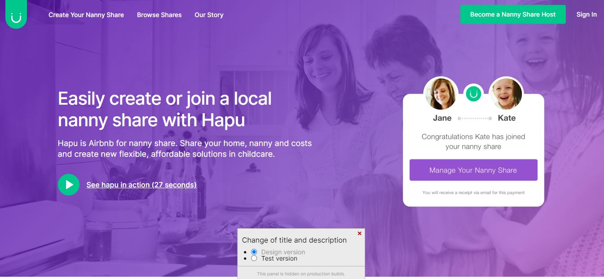

<h1 align="center">
     
</h1>

<p align="center">  
 Jungle Devs - React Challenge #001
</p>

---
## 🚀 Como executar o projeto

Este projeto pode ser executado apenas com esse repositorio.

### Pré-requisitos

Antes de começar, você vai precisar ter instalado em sua máquina as seguintes ferramentas:
[Git](https://git-scm.com), [Node.js](https://nodejs.org/en/). 
Além disto é bom ter um editor para trabalhar com o código como [VSCode](https://code.visualstudio.com/)

#### Rodando a aplicação web (Frontend)

```bash

# Clone este repositório
$ git clone https://github.com/Tuhh16/jungledevs-challenge

# Acesse a pasta do projeto no seu terminal/cmd
$ cd jungledevs-challenge

# Instale as dependências
$ yarn install

# Execute a aplicação em modo de desenvolvimento
$ yarn dev

# Para gerar o build da aplicação para produção execute o seguinte comando.
$ yarn build

# Execute a aplicação em modo de produção
$ yarn start

```

# 🛠 Sobre o teste A/B

<p>Para executar o teste foi usado a biblioteca @marvelapp/react-ab-test e esta sendo executado apenas no ambiente de desenvolvimento no arquivo index.tsx que está localizado no em components/Header/, segue as imagens mostrando o componente e o resultado no navegador: </p>

Código onde o teste é executado:
<p align="center" style="display: flex; align-items: flex-start; justify-content: center;">
     
</p>
Resultado A no navegador:
<p align="center" style="display: flex; align-items: flex-start; justify-content: center;">
     
</p>
Resultado B no navegador:
<p align="center" style="display: flex; align-items: flex-start; justify-content: center;">
     
</p>

## 💻 Tecnologias

As seguintes ferramentas foram usadas na construção do projeto:

-   **[ReactJs](https://pt-br.reactjs.org/)**
-   **[NextJs](https://nextjs.org/)**
-   **[TypeScript](https://www.typescriptlang.org/)**

> Veja o arquivo  [package.json](https://github.com/Tuhh16/jungledevs-challenge/blob/master/package.json)

---

## 📝 Licença

Este projeto esta sobe a licença [MIT](./LICENSE).

Feito por Arthur Teodoro Alves de Lima 👋🏽 [Entre em contato!](https://www.linkedin.com/in/arthurtlima/)
